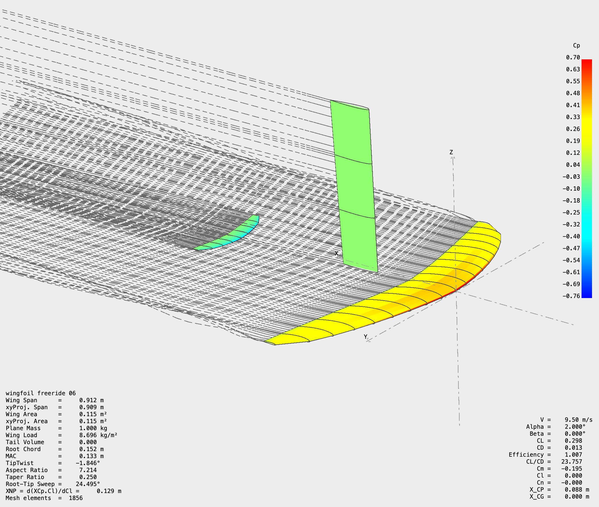

# Hydrofoil Geometry Optimizer

<table align="center">
  <tr>
    <td align="center">
       
    </td>
  </tr>
</table>

## What this does

The project looks for the geometry of a complete foil — main wing, fuselage, mast, stabilizer — that minimizes cruise drag for a given pilot weight and speed, under a stack of constraints aimed to discipline the programm into giving realistic outputs : lift equals weight at cruise, pitching moment balanced, structural stress below carbon limits, pilotability, etc. in a target range for the discipline. Hydrodynamics are handled by AeroSandBox with seawater as the working fluid. Everything lives in `src/`.
Three approaches have been tried in sequence.

### Scenarios

I wanted to model four main scenarios for the hydrofoil optimisation : `wingfoil`, `windsurf`, `downwind`, and `pumping`. Each one sets its own velocities, rig mass, takeoff CL margin, stab geometry, wing airfoil and ω_n target. Every scenario is tuned for a **performant freeride foil** — polyvalent, accessible, calibrated on the industry reference for that discipline. Switching scenario is a one-line edit (`case:` in `parameters.yaml`).
Each scenario has currently uploaded its best output so far, along with its technical file summerizing every aspect of it. The script 'optFixedProfileV2.py' should still give the nearly same output if you run it.

---

## V1 — parametric NACA with IPOPT

The first script (`optFixedProfileV1.py`) ran a structured sweep over NACA camber, thickness and sweep, with IPOPT handling the trim. It produced coherent wingfoil-class geometries but had a few persistent issues:

* The solver was boxed into tight parameter bounds. Because IPOPT is local and gradient-based, it hit these bounds constantly and either got stuck or refused to converge without manual tuning of the initial guess.
* When I loosened the bounds to help convergence, the optimizer drifted into "laboratory" designs — aspect ratios above 15, stabilizers producing positive lift, walls thinner than 1 mm — because nothing in the cost function captured structural strength or manufacturing limits.
* The aerodynamic check was global (one CL, one CD per evaluation). At freeride cruising speed (~10 m/s) the surface pressure peaks weren't computed, so nothing prevented the solver from picking airfoils that would be inefficient.

V1 was the right starting point to learn the problem, but its workflow scaled poorly.

---

## V2 — Kulfan section + structural model

The follow-up (`optMultidisciplinary.py`) moves to a Kulfan / CST parametrization of the airfoil itself rather than locking it to NACA. A handful of early-stage geometric filters reject self-intersecting profiles or trailing edges below 1 mm before the fluid solver sees them. A bending-moment + section-modulus check at the root forces realistic carbon thicknesses, and a static margin approximated estimation to get hands over the stability. The global solver is Differential Evolution, which copes much better than IPOPT with the messier landscape introduced by free airfoils (especially if hard constraints are used).

V2 works, but giving the airfoil that much freedom makes the search costly and noisy. It became clear that the section itself is not where the biggest wins are at this design fidelity — the planform and the trim are.

---

## Current state

`optFixedProfileV2` keeps the physics from the previous script and goes the other way on the airfoil question. The section is fixed per scenario (a NACA or others chosen for each discipline), and the optimizer is free to choose the planform — span & root chord for both wings — along with the trim variables: CG position, root incidence, washout, stab incidence, alpha at cruise, alpha at takeoff, fuselage length. Ten decision variables in total (CG is just informational).

### How the geometry is built

The wing chord is fixed and follows a pure ellipse, $c(r) = c_{tip} + (c_{root} − c_{tip}) . \sqrt(1 − r^2)$; I added classical dihedral (and anhedral resp. for the stab) and sweep angles to guarantee an aesthetically pleasing and anti-algae shape. I figured that setting the tip chord for both wings at around 30% of the root chord is non critical to the optimisation and reduces the number of variables.

Each scenario is anchored to a real industry foil whose specifications are public. The warm-start dimensions and the companion stab were chosen so that the optimizer starts from a known good design and the area target range overlaps the manufacturer's value.

| Scenario | Reference wing | Span | Area | AR | Profile | Companion stab |
|---|---|---|---|---|---|---|
| **wingfoil** | *AXIS BSC 890* | 890 mm | 1290 cm² | 6.43 | SD7062 (also tested NACA 4412) | *AXIS Skinny 365/55* — 365 mm / 168 cm² / AR 8.06 |
| **windsurf** | *Starboard Race 800* | 800 mm | 800 cm² | 8.0 | NACA 1410 (thin, low camber — matches the Tom Speer "thin and relatively symmetrical" race profile) | Starboard Tail 255 — 400 mm / 255 cm² / AR 6.3 |
| **downwind** | *Armstrong HA 1080* | 1020 mm | 1080 cm² | 9.6 | Eppler 387 (thin laminar) | *Armstrong HA 195* — 385 mm / 195 cm² / AR 7.6 |
| **pumping** | *Armstrong HA 1525* (or smaller) | 1200 mm | 1525 cm² | 9.5 | Eppler 423 (high camber for low-speed CL_max) | *Armstrong HA 195* (same kit as downwind) |

### Aerodynamics

The DE evaluation uses AeroBuildup — fast (≈ 0.5 s per call), good enough to run a 250-individual population over 60 generations in roughly ten minutes. AeroBuildup is purely additive and misses the wing / stab downwash interaction. We accept that during the search loop because the relative ranking of candidate designs is preserved between AeroBuildup and a fuller solver — so the cheap one is good for picking the shape. Once the DE has converged, the best design is automatically passed to a **3D trim refinement** using LiftingLine (downwash and induced drag computed properly): planform fixed, six trim angles re-optimised with Nelder-Mead (bounded), about 80 iterations, two more minutes. Switching from AeroBuildup to LiftingLine on the same geometry typically lowers the estimated drag by 30-40 % and raises L/D from around 17 to around 24 — that's the gap between "additive 2D" and "real 3D circulation" rather than an optimization failure.

The old local L-BFGS-B polish on the DE result was dropped: gradient-based methods don't behave well on AeroBuildup's noisy stall transitions, and "polishing in 2D the wrong physics" wasted compute. The 3D refinement replaces it with something that's slower per evaluation but actually moves toward the real optimum.
The objective is multi-point: $D_{cruise} + 0.3 \times D_{takeoff}$. The takeoff weight (0.3) discourages designs that need huge induced drag to lift off, without overpowering the cruise term.

### Stability and pilotability

This is the part that took the longest to figure out. The classical aircraft static margin (SM normalised by mean chord) doesn't really work for a wingfoil : the pilot's CG sits up at the board level, not in the wing chord plane, so SM/c values look absurd (50-100 %) while the foil is actually well-behaved. I dropped SM/c as the design constraint and replaced it with a **pilotability** target expressed as a pitch natural frequency $ω_n$ (Hz). What the pilot actually feels isn't a static margin in chord units — it's the speed at which the foil responds to a pitch perturbation, i.e. the short-period mode. We compute it from $ω_n^2 = -Cm_{\alpha} \times q \times S \times c / I_{yy}$, with $I_{yy} = m_{total} \dot r_{gyr}^2$ (gyration radius ≈ 30 cm for a rider standing on the board, set in `parameters.yaml`).

Getting an accurate $Cm_{\alpha}$ turned out to be the harder problem. I tried two approaches:

1. **Analytical formula + empirical de_da calibration** (`calibrate_de_da.py`, kept for reference). The textbook $Cm_{\alpha} = -SM \times CL_{\alpha, total}$ with $SM$ from a vortex-horsepower formula needs an $\epsilon = \text{de_da}$ term for the downwash the stab sees. The textbook $4/(AR+2) \approx 0.5$ is wildly off for hydrofoils — the tail arm is so long that the downwash has mostly dissipated by the time it reaches the stab. So at startup, the script ran 4 VLM calls at the bounds of `fuselage_length` to invert the formula and fit `de_da(fl) = slope·fl + intercept` by linear regression. 
2. **Direct finite-difference on AeroBuildup** (current). The trim solver already calls AeroBuildup at $\alpha = 0 \deg$ and $\alpha = 3 \deg$ to bracket the cruise lift target. Those two calls return $Cm$ too, so $dCm/d\alpha = (Cm_{hi} − Cm_{lo}) / \Delta \alpha$ is free — no extra solver call, no startup VLM. AeroBuildup includes the actual wing→stab downwash (via its lifting-line strip integration), so the resulting $Cm_{\alpha}$ is within ~3 % of a full VLM verification, vs the 15-25 % residual error the analytical formula carried even with calibrated `de_da`.
   
The second approach was chosen, because the calculation additional costs were negligeable, and the precision on stability was crucial to the optimisation.

### Dynamic reserve on the stabiliser

One thing that's invisible in a steady-state optimiser but critical in real foils: the stab needs to be bigger than the strict minimum required at cruise, because real water isn't steady. Gusts, swell, rider stance shifts, pumping cycles — all of these momentarily demand much more pitch authority than the cruise design point.
Without explicit "robustness" constraints, the optimiser will converge to a stab that satisfies cruise trim with just a few Newtons of download. That's mathematically optimal — and physically inoperable. The first time a 50 kt gust hits, the rider has no pitch authority left because the stab is already at near-zero loading.

The fix lives in `scenarios.yaml` via the `stab_load_range` per discipline. The lower-magnitude bound (closer to zero) is now set such that the stab must produce a meaningful download at the design point — typically enough to keep ~50 % of its CL budget free as reserve. This approach also forces the optimisation to not look at tandem solutions (both wing and stab lifting) that are only used for race speed-oriented foils, but are not desirable for a freeride approach.

### Stab control authority 

I added a second constraint that depends on stab size directly: the lift derivative $dF_{stab}/d\alpha = CL_{\alpha,stab} \times q \times S_{stab}$ must be at least a discipline-specific target. Physically, this is the force change per degree of incidence variation — what the pilot feels when a wave tilts the foil.
The key point: this is not redundant with $\omega_n$, which measures the *combined* stiffness/inertia of the system (wing + stab) — $dF_{stab}/d\alpha$ measures only the stab's contribution, and scales linearly with area at fixed cruise $q$. So requiring a minimum $dF/d\alpha$ directly constrains a minimum stab area, scaled appropriately to the dynamic pressure of each discipline.

This is the cleanest physical formulation I found of "the stab needs to be big enough" that isn't either arbitrary (just impose a min area) or hand-wavy (force a specific download). It naturally scales with q, which means the same physical authority constraint translates to a bigger stab on slow-speed pumping foils and a smaller one on race windsurf.

### Structure

The root cross-section is modeled as a hollow elliptic carbon shell, around 1.5 mm thick by default (`wing.skin_thickness` in `parameters.yaml`), with a polystyrene core whose contribution is neglected. Calculating and using as a constraint the structural strenght of the foil is critical to ensure the optimization doesn't create absurd shapes (like AR=20 for example).

The constraint is **fatigue**, not ultimate. Carbon-epoxy cross-ply breaks around 300 MPa, but nobody designs foils to ultimate, the structure fatigues long before it fractures. The allowable working stress is therefore set at fatigue_allowable_ratio $\times \sigma_{ult}$ (default 40 %, so ~120 MPa). On top of that, the loading we compute multiplies the static cruise load by a `load_peak_factor` (default 2.5×) to estimate the dynamic peak the structure sees in real conditions (wave impacts, tight turns, hard pumping). So the check is: peak von Mises stress under 2.5g loading < 120 MPa.

With this new fatigue-based criterion, AR 11 sits at the limit, AR 15 and above are infeasible : that maps closely to why real freeride wings cluster around AR 6-10 and why race wings rarely go past AR 12 even though carbon could "in theory" allow much more.

---

## Results Analysis

### Optimization convergence

The script was confirmed deterministic under a fixed seed. With the default configuration (`N_starts: 3`, scipy seed = 42, Sobol-scrambled initial population), every scenario re-run after its reference produces the same geometry and trim values to 3 decimal places. 
I dropped the multistart mode which gave no significant change in regards to the single-start mode, which convergence was reached within ~60 DE generations (≈ 9 minutes wall-clock on a laptop CPU).

### XFLR5 Validation

`full_report()` writes an `*_plane.xml` next to the fiche technique for each output. The plan for the validation is to load it in XFLR5, run a stack of independent checks against our internal physics and report agreement / disagreement per scenario.

**Hydrodynamic checks (VLM2, 30 chordwise × 50 spanwise panels per surface, seawater density)**

* α-sweep from -3° to 10° at v_cruise → CL(α), CD(α), L/D curves. Compare CL at the predicted cruise α to AeroBuildup (DE phase) and LiftingLine (3D refinement); we expect AeroBuildup to under-predict CL by 5-10 % and LiftingLine to land within 2-3 % of XFLR5.
* Spanwise circulation and induced-drag distribution at cruise α — confirm the elliptic planform actually approaches elliptic loading, sanity-check the wing/stab downwash interaction that AeroBuildup misses.
* Cp distribution at cruise α on the wing and stab root sections — verify no localised cavitation pocket below σ_v that the AeroBuildup-based Cp_min check might have glossed over.

**Stability checks (XFLR5 stability analyser with `I_yy = m_total · r_gyr²`)**

* Trim α found by XFLR5 should match `alpha_cruise` from the fiche technique within a few tenths of a degree.
* Short-period eigenvalue → ω_n in Hz. This is the key cross-check, because our ω_n comes from a finite-difference `Cm_α` on AeroBuildup at α = 0° and 3°. XFLR5's eigenvalue includes the full inertia matrix and pitch damping, so agreement within ~15 % validates the dimensional ω_n we use as a freeride pilotability target.
* `Cm_α`, `CL_α`, `Cm_q` derivatives at trim α → compare with our 2D values; tail downwash (`dε/dα`) is included by XFLR5, so this isolates how much error our AeroBuildup-based `Cm_α` carries.
* Neutral point location relative to CG — confirms the sign and magnitude of SM independently of the downwash calibration baked into AeroBuildup.

Outcome: one validation table per scenario in this README, listing predicted vs XFLR5 values with the percentage gap, so failure modes of the cheap solvers used inside DE are made explicit.

---

## What I knowingly ignored

A few things I left out, in full awareness that they would matter for a really finished design:

* Yaw and roll stability — only longitudinal (pitch) trim is enforced.
* Variation of immersion depth and air ventilation (free-surface effects) in choppy water.
* Elastic deformation of the mast and twist of the wing under load, plus interference drag where the wing, fuselage and mast meet.
* Unsteady regimes (pumping cycle in particular). Everything is computed as if the foil were in steady cruise.

Any of these can make the output unrealistic for a specific use case. Pumping especially is poorly captured because the whole physics is unsteady, even though the geometry it produces is still useful as a starting point.

---

## Final thoughts

This isn't going to spit out a ready-to-mould foil. It's a parametric exploration tool with enough structural and hydrodynamic discipline that the outputs land in the right neighbourhood. Building it from scratch was an attempt to take seriously a problem that whole companies spend years on — it forced me into the hydrodynamics, the structural side, the numerical optimization, the way real CG and stability behave on a hydrofoil, and a lot of fiddly engineering judgement that no textbook lays out clearly. The code reflects that learning curve.

---

## Acknowledgements

This work was carried out within the ISAE Supaéro Foil club. Thanks to fellow club member Gaspard Bougnoux for his initial work, which gave me something to push against and forced me to keep looking for alternative solutions when the obvious ones didn't work.

## License

Distributed under the MIT License. See `LICENSE` for details.
